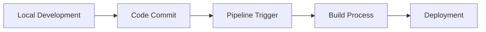

# CI/CD Workflow Documentation


Special thanks to [Nextwork](https://www.nextwork.org) for this amazing oppurtunity.

## Table of Contents
- [Overview](#overview)
- [System Architecture](#system-architecture)
- [Development Environment](#development-environment)
- [Pipeline Components](#pipeline-components)
- [Security Measures](#security-measures)
- [Best Practices](#best-practices)

## Overview

### Purpose
This documentation outlines our CI/CD workflow implementation using AWS services, designed to streamline the development and deployment process while maintaining high security and reliability standards.

### Scope
- Development environment configuration
- CI/CD pipeline setup
- Infrastructure management
- Security implementation
- Best practices and guidelines

## System Architecture

### Components Overview
Our CI/CD workflow integrates the following key components:

#### Development Environment
- **IDE**: Visual Studio Code
- **Configuration Files**:
  - settings.xml
  - buildspec.yml
  - appspec.yml
- **Local Scripts**: Custom automation scripts

#### AWS Services Integration
1. **CodeArtifact**
   - Package management
   - Dependency resolution

2. **CodeBuild**
   - Source compilation
   - Testing execution
   - Artifact generation

3. **S3 Storage**
   - Build artifact storage
   - Version management
   - Deployment packages

4. **CodeDeploy**
   - Automated deployment
   - Environment management
   - Health monitoring

## Development Environment

### VSCode Setup

#### Required Extensions
```plaintext
- AWS Toolkit
- GitHub Integration
- Code Quality Tools
```

#### Configuration Guidelines
1. Clone repository
2. Configure AWS credentials
3. Set up environment variables
4. Verify connections

### Local Development Flow


## Pipeline Components

### CodePipeline Structure

#### Source Stage
- GitHub integration
- Version control
- Branch management

#### Build Stage
- Compilation process
- Testing execution
- Quality checks

#### Deploy Stage
- Environment selection
- Deployment strategy
- Health checks

## Security Measures

### Access Control
- IAM roles and policies
- Least privilege principle
- Regular access reviews

### Infrastructure Security
- VPC configuration
- Network segmentation
- Security groups

## Best Practices

### Code Management
1. Regular commits
2. Branch protection
3. Code review process

### Deployment Strategy
1. Blue-green deployment
2. Rollback procedures
3. Monitoring implementation

### Security Guidelines
1. Secret management
2. Access control
3. Regular audits

## Version Control

| Version | Date | Author |
|---------|------|---------
| 1.0.0 | 2025-01-29 | Roushan Anand

## Contact Information

#### Email: anandroushan18@gmail.com
---

*Last Updated: August 21, 2025*
